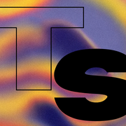
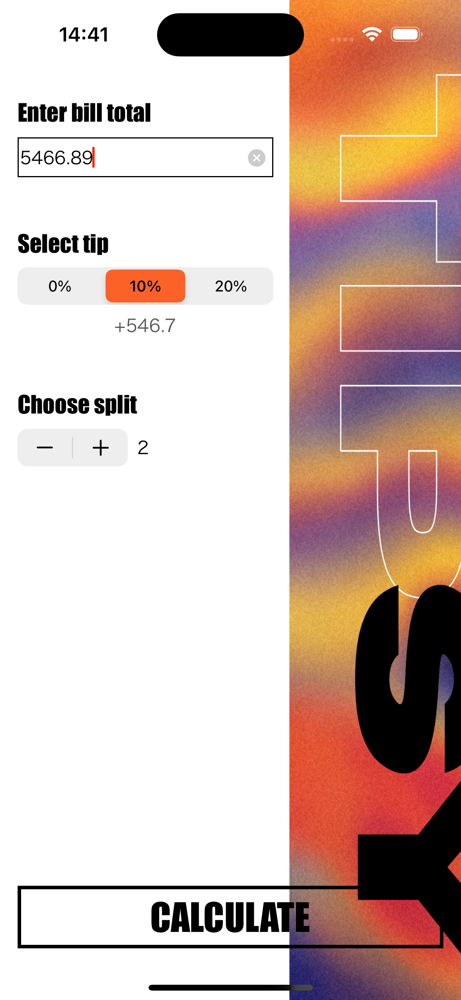

#  Tipsy

This is the tip-calculating app that helps people to split the bill. No one can work out $145.56 split between 5 people with a 20 percent tip. With the Tipsy app in hand, you’ll never need to do maths ever again!

## About project

The project has been created by using Swift, Storyboard (+ Auto Layout), and following the MVC pattern. Tipsy consists of two screens.

## Screens

### Launch Screen

  

### Calculate Screen

  

### Result Screen

  
